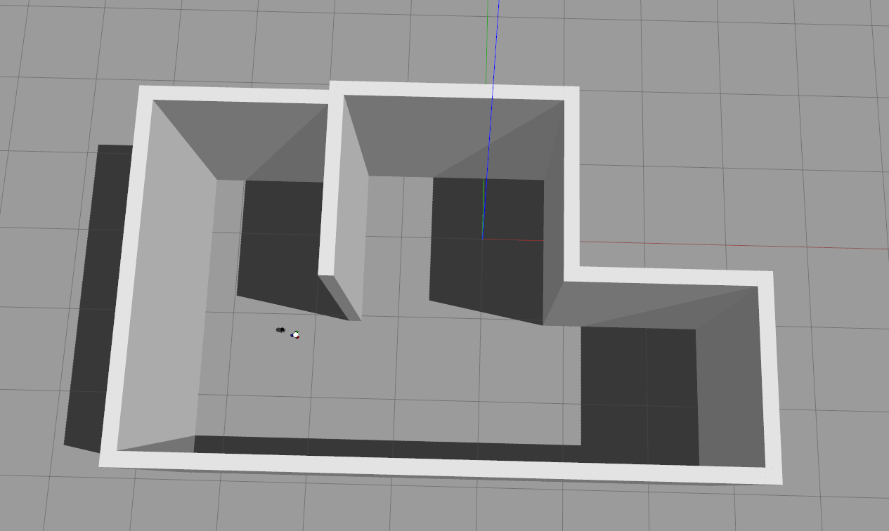
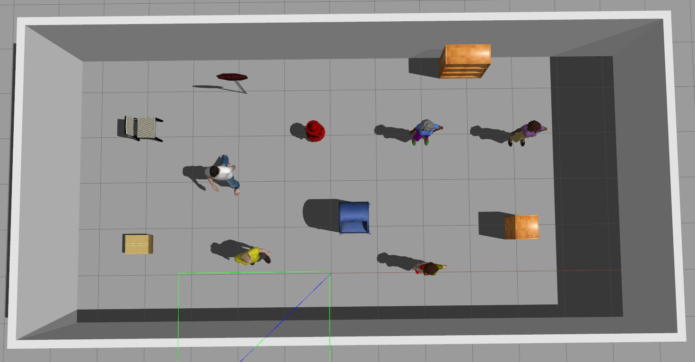
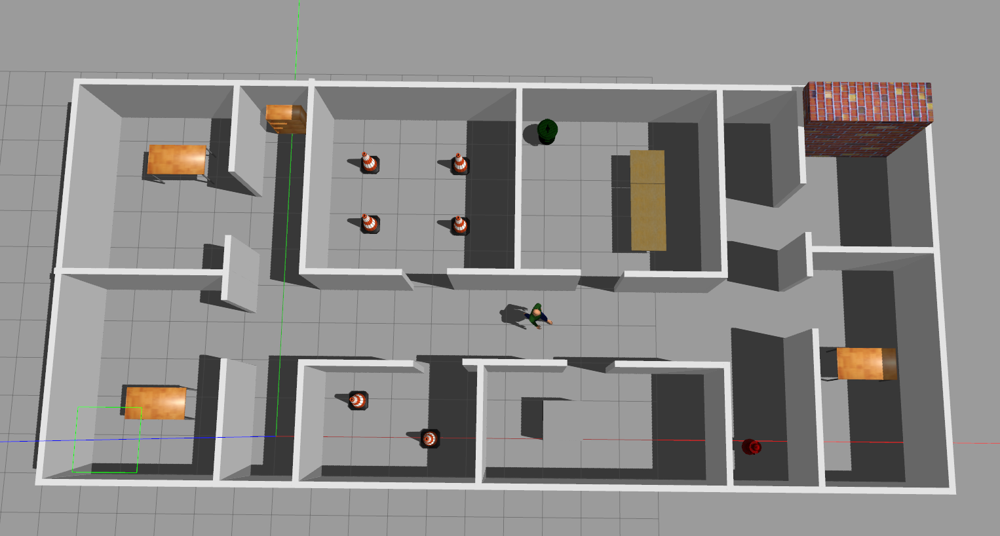
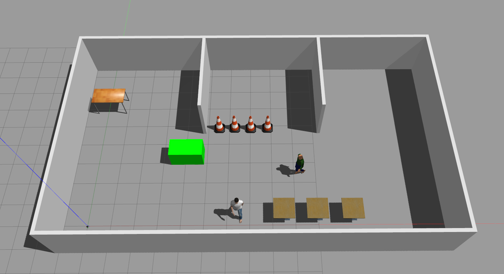
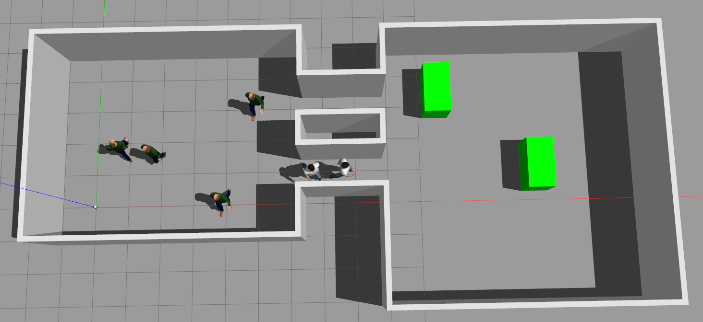
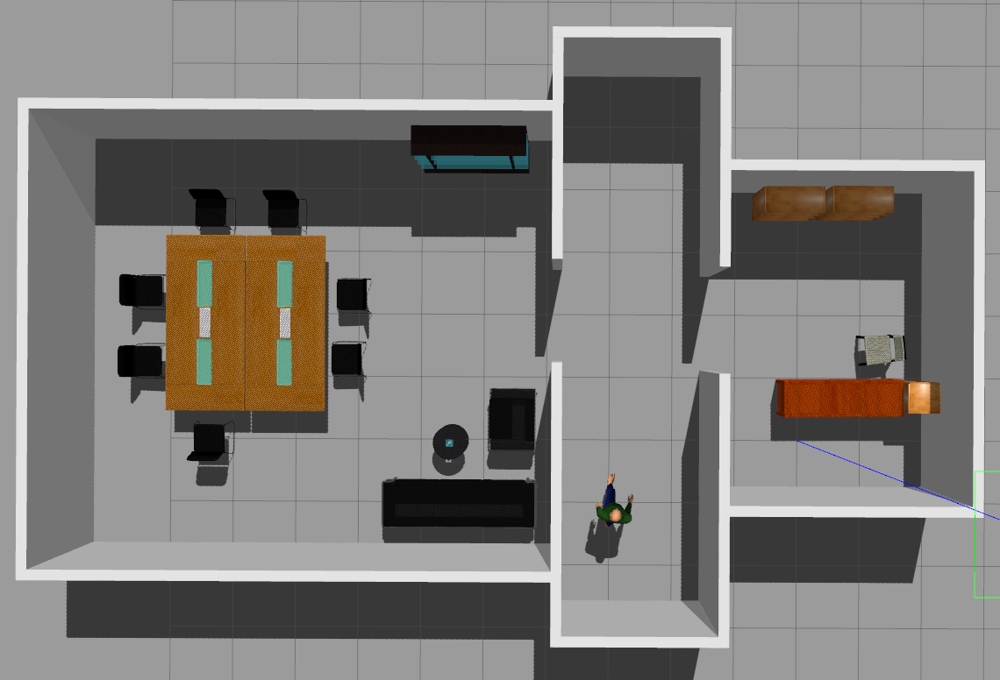

# Autonomous robot simulation
Simulation of autonomous omnidirectional operation in environments of varying complexity.

## Features
1. ROS1 (Noetic)
2. Gazebo 11
3. Omnidirectional robot
4. Scenarios: Static environment (Done) / Static environment with dynamic objects (TODO) / Dynamic environment with Dynamic objects (TODO)
5. Localisation
6. Autonomous navigation
  
## Environments
1. empty_room - small empty room. Static environment.

  
   

2. big_room - big room with lots of small static obstacles

  
   

3. biolab - lab with 8 rooms and long hall. Static environment with dynamic object (person).

  
   

4. airport terminal - big open space. Static environment with dynamic objects: box and person.

  
   

5. metro - two big open spaces with two halls connecting them. Dynamic envoronment (added standing people in one of halls which are not drawn on the map) with dynamic objects: 4 people in 1st space and 2 boxes in 2nd space

  
   

6. conference_room - small and big room with tight placed furniture. Static environment with dynamic object (person).  

  
   

## Run
1.  `cd ~/catkin_ws/src`
2.  `git clone https://github.com/REPOSITORY_NAME`
3.  `cd ~/catkin_ws`
4.  `catkin_make`
5.  `source ~/catkin_ws/devel/setup.bash`
6.  `source ~/.bashrc`

I Scenario: SLAM (world_name - name of the environment to save)

7. `roslaunch omni3ros_pkg gazebo_rviz_controllers.launch world:=world_name`- Launch model simulation (Gazebo + Rviz) with controllers
8. `rosrun teleop_keyboard_omni3 teleop_keyboard_omni3.py`- Send Twist control commands to model with keyboard
9. `rosrun teleop_keyboard_omni3 wheel_controller.py`- Convert Twist control commands to motor velocity commands
10. `rosrun teleop_keyboard_omni3 odom_publisher.py` - Run odometry broadcasting
11. `roslaunch omni3ros_pkg robot_localization.launch` - Run EKF wheel odometry and IMU sensor fusion
12. `roslaunch ira_laser_tools laserscan_multi_merger.launch` - Run merger of laserscans from two lidars
13. `roslaunch omni3ros_pkg gmapping.launch`- Launch gmapping module o build the map
14. `rosrun map_server map_saver -f world_name` - Save map of environment
15. `roslaunch omni3ros_pkg move_base.launch` - Rub autonomous navigation based on goal set with use of Rviz
16. `rosrun rqt_gui rqt_gui` - Run rqt to vilusalize node graph, topics and tf 

II Scenario: Localization (world_name - name of the environment to use)

7. `roslaunch omni3ros_pkg gazebo_rviz_controllers.launch world:=world_name`- Launch model simulation (Gazebo + Rviz) with controllers
8. `rosrun teleop_keyboard_omni3 teleop_keyboard_omni3.py`- Send Twist control commands to model with keyboard
9. `rosrun teleop_keyboard_omni3 wheel_controller.py`- Convert Twist control commands to motor velocity commands
10. `rosrun teleop_keyboard_omni3 odom_publisher.py` - Run odometry broadcasting
11. `roslaunch omni3ros_pkg robot_localization.launch` - Run EKF wheel odometry and IMU sensor fusion
12. `roslaunch ira_laser_tools laserscan_multi_merger.launch` - Run merger of laserscans from two lidars
13. `roslaunch omni3ros_pkg amcl.launch world:=world_name` - Run AMCL localization
14. `roslaunch omni3ros_pkg move_base.launch` - Run autonomous navigation based on goal set with use of Rviz
15. `rosrun rqt_gui rqt_gui` - Run rqt to vilusalize node graph, topics and tf 

## Autonomous navigation
Goal poses can be set with use of Rviz. 

## Releases
1.0:
* Omnidirectional platform with IMU and 2D laser sensors. EKF does fusion of wheel odometry with IMU data. Than AMCL takes the result and predicts the correct position taking also into account laser scans. Standard ROS path planning algorithm based on set goal position provides global and local paths and control commands to follow them. Platform could be either controlled by these commands to reach the goal pose or with manual keyboard interface.

## Models
Some of models are taken from http://data.nvision2.eecs.yorku.ca/3DGEMS/.